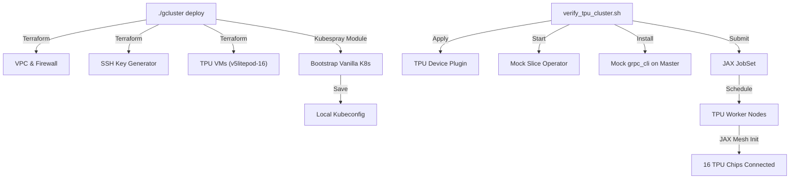

# E2E Hackathon Guide: Vanilla Kubernetes on TPUs (Project Bloom Simulation)

This guide demonstrates the complete Critical User Journey (CUJ) for the **Vanilla Kubernetes & TPU VM** support added to Cluster Toolkit for the 2026 CMCS India Hackathon.

By following these steps, you will:
1. **Compile** the updated `gcluster` CLI with generic Kubernetes orchestration support.
2. **Deploy** a simulated bare-metal Kubernetes cluster on GCP with TPU VMs (v5litepod-16) bootstrapped via Kubespray/Ansible.
3. **Verify** the TPU cluster and JAX mesh execution using the automated verification script.

---

## Prerequisites

Before starting, ensure you have:
*   A Google Cloud Project with TPU quota: `cloud-tpu-multipod-dev` (or your allocated project).
*   `gcloud` CLI installed and authenticated: `gcloud auth application-default login`.
*   Python 3 and `pip3` installed on your deployer machine.
*   `kubectl` installed.

---

## Step 1: Compile the Updated CLI

We have modified the Go orchestrator and CLI flags to decouple job submission from GKE. Build the new `gcluster` binary:

```bash
# Ensure Go modules are enabled and compile the binary
GO111MODULE=on make
```

This compiles the updated codebase and outputs the `gcluster` binary in the root directory.

---

## Step 2: Deploy the TPU Kubernetes Cluster

We will use the TPU-enabled blueprint [examples/hackathon-tpu/hackathon-tpu-k8s.yaml](file:///usr/local/google/home/swarnabm/cluster-toolkit/examples/hackathon-tpu/hackathon-tpu-k8s.yaml). This blueprint:
*   Creates a dedicated VPC and subnets.
*   Opens firewall ports `22` (SSH) and `6443` (Kubernetes API).
*   Generates a secure SSH key pair locally.
*   Provisions 1 raw GCE VM for the K8s Master, and a **TPU v5e slice (v5litepod-16)** containing 4 TPU VMs (acting as K8s Workers).
*   Triggers the `kubernetes-kubespray` module to bootstrap vanilla Kubernetes across the master and TPU VMs.

Run the deployment:

```bash
# Replace <YOUR_PROJECT_ID> with your GCP project (e.g., cloud-tpu-multipod-dev)
./gcluster deploy examples/hackathon-tpu/hackathon-tpu-k8s.yaml --project <YOUR_PROJECT_ID> -w --force
```

*Note: The Kubespray bootstrap process can take 10–15 minutes.*

Once complete, it will save the cluster's `kubeconfig` to `hkthn-tpu-k8s-1/primary/kubeconfig`.

---

## Step 3: Run Automated TPU & JAX Verification

We have provided an automated script to verify that the TPU VMs are correctly integrated into the Kubernetes cluster, the TPU device plugin is running, and a JAX distributed workload can successfully initialize its mesh.

Run the verification script:

```bash
# Note: Ensure the script points to your active deployment's kubeconfig
examples/hackathon-tpu/verify_tpu_cluster.sh
```

### What the Verification Script Does:
1. **Checks Kubeconfig:** Verifies the connection to your newly deployed vanilla cluster.
2. **Verifies Nodes:** Lists the master and 4 TPU worker nodes.
3. **Installs TPU Device Plugin:** Applies the TPU device plugin configured for vanilla Kubernetes (schedules on all non-master nodes).
4. **Sets up Bloom Control Plane Mocks:**
   * Applies the `Slice` Custom Resource Definition (CRD).
   * Starts the **Mock Slice Operator** in the background to simulate the Bloom slice manager.
   * Installs a mock `grpc_cli` on the Master VM to simulate the hardware topology coordinator.
5. **Submits JAX Workload:** Submits a `JobSet` (`maxtext-tpu`) simulating a MaxText training job.
6. **Monitors & Verifies:** Waits for the JAX pods to start, and streams the logs to verify that JAX has successfully detected and initialized the **16-chip TPU mesh** across the 4 hosts.

### Expected Output:
Upon successful verification, you should see logs from the JAX pods showing:
```text
JVEM initialized successfully.
TPU devices found: 16
Mesh topology: 4x4
```

---

## E2E TPU CUJ Summary


